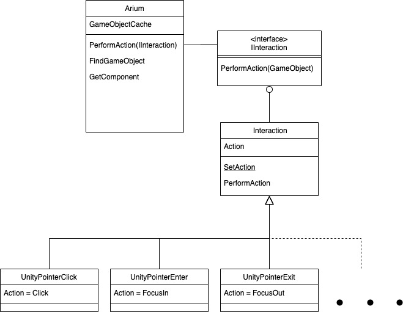

# Arium
Automation Testing Framework for AR(Unity) Applications.

## About Arium:
Arium is an automation testing framework for 3D applications built on top of Unity. It helps the Developers/QA to run functional tests on 3D apps on any platforms.
ie., Unity Editor,Android,UWP etc..

Arium comes with the basic Unity interactions:
- Animator
- DragHandler
- PointerClickHandler
- PointerEnterHandler
- PointerExitHandler
- RigidBody

## License
<b>© 2020 ThoughtWorks, Inc.</b>  
[AGPL-3.0 License](LICENSE)

## Contributors

Maintained by <b>[ThoughtWorks](http://thoughtworks.com/)</b> 

## Project Charter 
- [Neelarghya Mandal](https://github.com/Neelarghya/) (Contributors)
- [Jayachandran S](https://github.com/Jayachandranaug29/) (Contributors)
- [Raju Kandaswamy](https://github.com/rkandas) (Reviewer)
- [Kuldeep Singh](https://github.com/thinkuldeep) (Reviewer)

## Releated Articles:
[Arium - An Automation framework for Unity/XR](https://medium.com/xrpractices/arium-an-automation-framework-for-unity-xr-d51ed608e8b0)

## Setup:
1. Download Arium Unity Package https://github.com/thoughtworks/Arium/releases
2. Open your Unity project which needs to be automated.
3. Double click on the downloaded Unity package.
4. Select all and click on Import Button.

## Running Sample Test cases:
1. Open UnitySampleScene in the project hierarchy - Samples >> AriumSample >> Scenes >> UnitySampleScene.
2. Open Unity Build settings - File >> Build Settings
3. Click on Add Open Scenes.
    Note: Make sure the UnitySampleScene is selected 
4. Close Unity build settings window
5. Open TestRunner window in Unity - Window >> General >> TestRunner.
6. Expand the Arium hierarchy in the Test Runner - Arium >> AriumSampleTests.dll >> Samples >> AriumSample >> UnityTestRunner
7. Select PlayMode Tests and Right click on UnityTestRunner and Click on RUN.
8. Test Cases will start executing and results will be displayed on the TestRunner.

## Arium Usage:

### Instantiate Arium:

To use Arium framework, Arium should be instantiated inside the test class as mentioned below

#### syntax:

    Arium _arium = new Arium();
   
### Find GameObjects:

To find a Gameobject from the Unity Scene hierarchy using its name.

#### Syntax:
    _arium.FindGameObject("Display");
    
##### Paremeters:
    String - Name of the Gameobject.
    
##### Return type:
    UnityEngine.GameObject

### GetComponents:

To retrieve the components attached to a GameObject

#### Syntax:
    _arium.GetComponent<Name of the component here>(Name of the GameObject here)
    
##### Paremeters:
    String - Name of the Gameobject.
    UnityComponent - UnityComponent type
    
##### Return type:
    UnityEngine.Component

### PerformActions:

To interact with the UnityGameobjects on runtime.

#### syntax:
To click on a particular gameobject.
 
    _arium.PerformAction(new UnityPointerClick(), "Name of the gameobject here");
    
##### Paremeters:
    Intercation - Type of the interaction need to performed on a gameobject, in this case it is UnityPointerClick()
    String - Name of the Gameobject.

# Class Diagram

